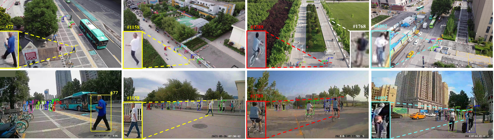
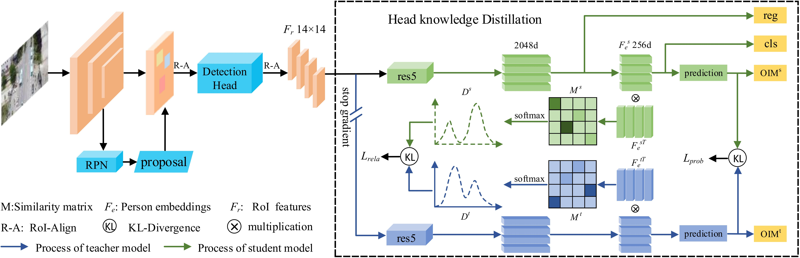
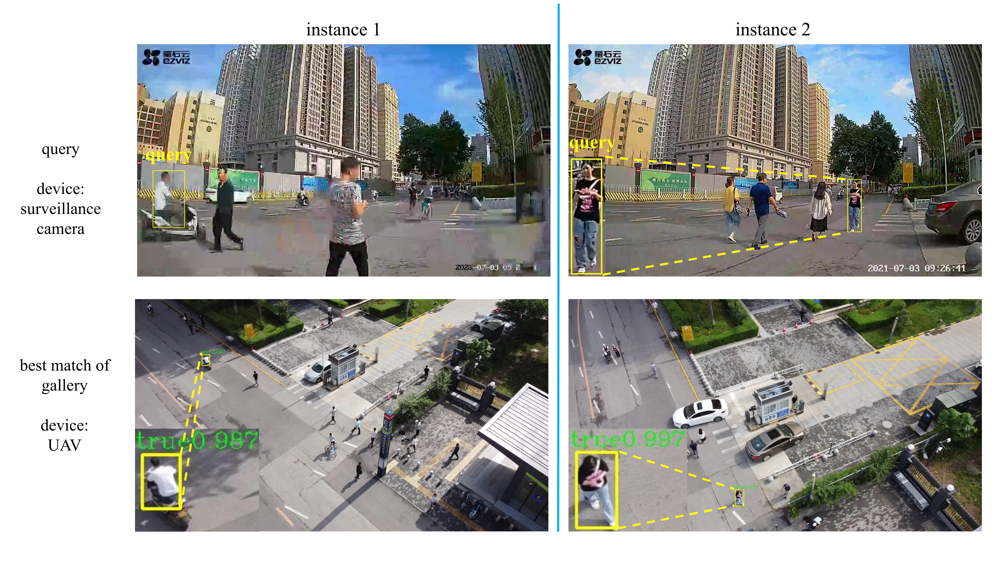

## Ground-to-Aerial Person Search: Benchmark Dataset and Approach

Here is the source code of our paper Ground-to-Aerial Person Search: Benchmark Dataset and Approach.  
In this paper we are the first to construct a large-scale ground-to-aerial person search benchmark dataset, named **G2APS**, for the
cross-platform ground-to-aerial person search. The dataset can be downloaded at [here code 1357](https://pan.baidu.com/s/1MRrhqoQzwxw7qOx4Lqdl2g).  
We are glad to see research on G2APS and new ideas for Ground-to-Aerial Person Search.

**Fig.1 Exemplars of aerial images and their corresponding ground surveillance images.**

Besides, **Head Knowledge Distillation(HKD)** module is proposed in this paper to alliviate conflict exists in Optimization 
objective in detection and Re-ID subtasks.Finally, our method gain sota-of-the-art performance in G2APS,CUHK-SYSY and PRW.

**Fig.2 Overview of our head knowledge distillation(HKD) framework.**

**Tab.1 Performance of baseline+HKD comparision with SOTA method.**   

| dataset   | method     | mAP              | top-1            | model |
|-----------|------------|------------------|------------------|-------|
| G2APS     | SeqNet     | 33.96            | 44.52            | -     | 
|           | SeqNet+HKD | 39.40(+5.44)     | 49.12(+4.60)     |       |
|           | COAT       | 40.32            | 50.53            | -     |
|           | COAT+HKD   | **41.41(+1.09)** | **51.94(+1.41)** |       |
| CUHK-SYSU | SeqNet     | 93.8             | 94.6             | -     | 
|           | SeqNet+HKD | **95.25(+1.45)** | **96.10(+1.5)**  |       | 
|           | COAT*      | 93.68            | 94.1             | -     |
|           | COAT+HKD   | 93.86(+0.18)     | 94.76(+0.66)     |       | 
| PRW       | SeqNet     | 46.7             | 83.4             | -     |
|           | SeqNet+HKD | 51.49(+4.79)     | 85.12(+1.72)     |       |
|           | COAT*      | 52.45            | 86               | -     |
|           | COAT+HKD   | **53.49(+1.04)** | **86.63(+0.63)** |       |

note:* indicates the experimental results we reproduced.

**Fig.3 Evaluation of two test samples.**

## Training and Testing
[Running_instruction](Running_instruction.md)
